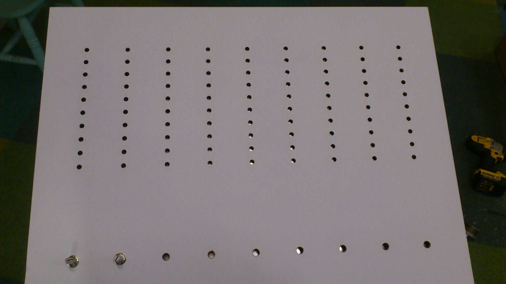
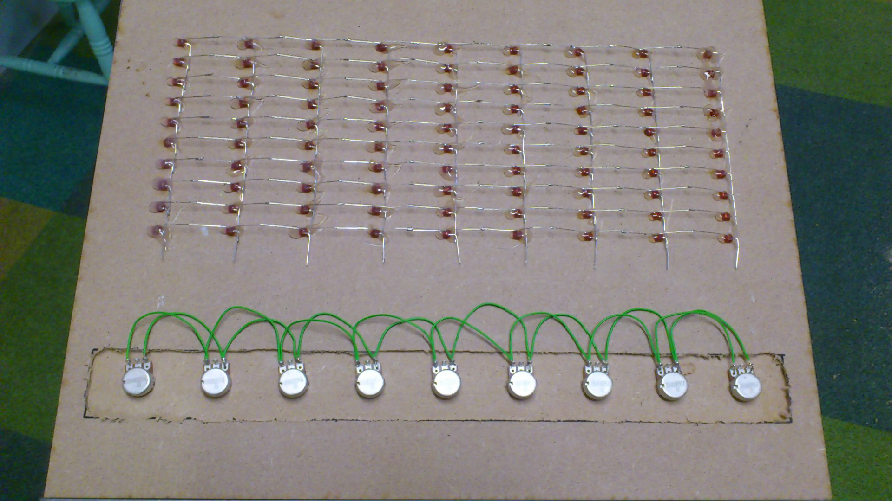
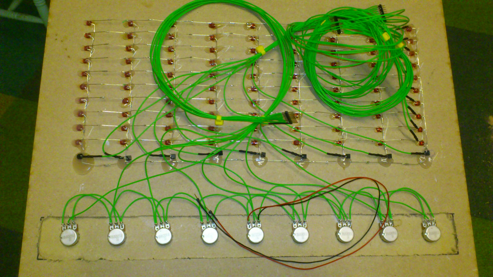
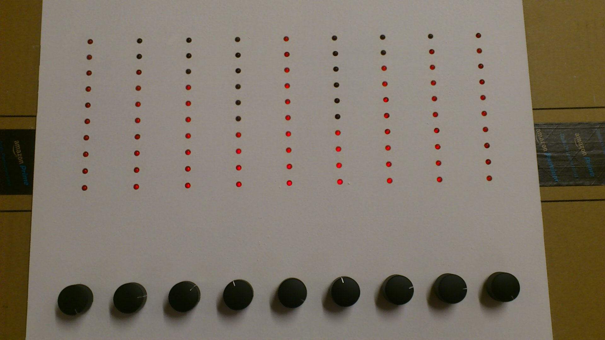

#Arduino combination lock

##Introduction

The software reads the voltage across potentiometers and when they are set in the correct position it will trigger an output pin from low to high that can be used to drive a buzzer and/or a relay.

The position of each potentiometer is shown on a strip of LEDs.  The number of LEDs in each strip is configurable.  However, it is not necessary to have LEDs at all.

##Structure of the code

The code is written with a number of #define statements to enable you to configure the number of LEDs in each strip, setup button input pin, output pins etc.

The main loop has been written for speed so that the multiplexed LEDs are as bright as possible and so the brightness doesn't vary depending on how many LEDs are illuminated.  It could probably be refactored or use OOP but that may impact the LED multiplexing causing varying brightness.

##Code setup procedure

To setup your own code, press and hold the setup button while you power on the Arduino.  When the buzzer sounds, release the button and the LEDs should flash (note, if you have a brand new Arduino with nothing in the EEPROM, it will automatically enter this setup mode). Set the potentiometers to the code you require.  Press the setup button to save the code to EEPROM.  The new code will now be used.

##YouTube videos:

Initial demo:

https://youtu.be/bmn1OsS9Bd4

See if you can spot it here (there are several places):

https://www.youtube.com/watch?v=lcq2fAbNk-w

##Photos:

A laser cut panel was used to mount the potentiometers and LEDs

The LEDs were pushed in from behind and secured with hot glue.  The LEDs were also soldered in a matrix.

Driver transistors and current limiting resistors were added and many wires were attached.

After connecting to the Arduino and setting the code, the LEDs were quite bright given they are multiplexed.

##Schematic

